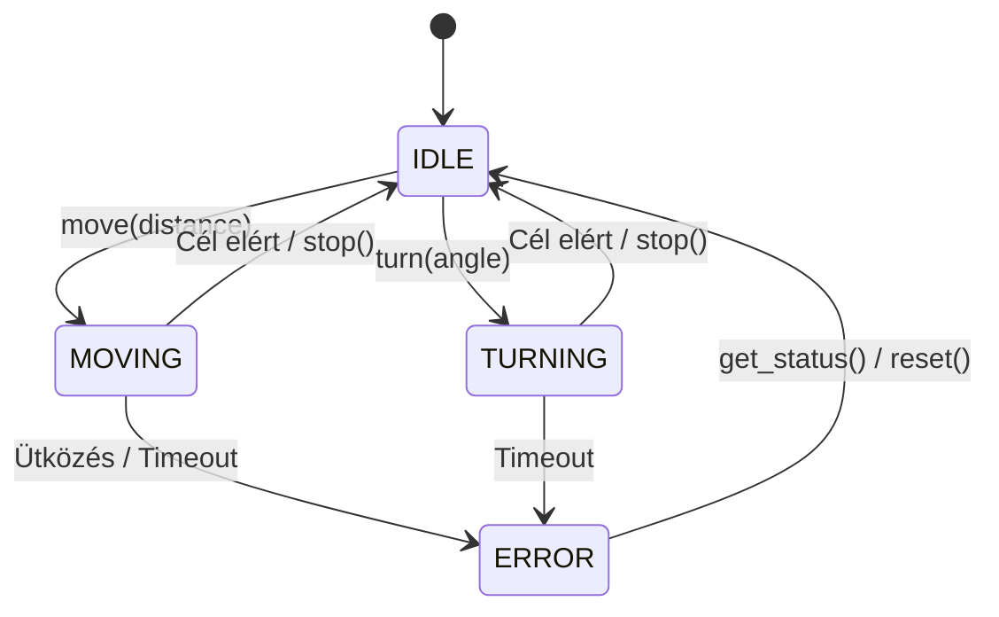

# Rover API Protokoll (v1.0) - M05

Ez a dokumentum definiálja a rover formális, determinisztikus és biztonság-kritikus kommunikációs protokollját.

## 1. Állapotgép (State Machine)
A rover szigorú állapotgépet használ. Két mozgási parancs nem fedheti át egymást.



## 2. Biztonsági Korlátok (Safety Constraints)
*   **Max sebesség:** 2.0 m/s
*   **Max távolság / parancs:** 5.0 méter
*   **Max szög / parancs:** 360 fok
*   **Watchdog Timeout:** 2.0 másodperc (hálózati csend esetén kényszer-megállás).
*   **Idempotencia:** A szerver a `request_id` alapján szűri a duplikált kéréseket.

## 3. JSON Schema (Alap kérés és válasz)

**Request Schema:**
```json
{
  "type": "object",
  "properties": {
    "request_id": { "type": "string" },
    "version": { "type": "string", "enum": ["1.0"] },
    "action": { "type": "string", "enum": ["move", "turn", "stop", "observe", "get_status"] },
    "payload_value": { "type": "number" }
  },
  "required": ["request_id", "version", "action"]
}
```

**Response Schema:**
```json
{
  "type": "object",
  "properties": {
    "request_id": { "type": "string" },
    "status": { "type": "string", "enum": ["success", "error", "busy"] },
    "error_code": { "type": "string" },
    "rover_state": { "type": "string" },
    "position": { "type": "object" }
  }
}
```

## 4. API Műveletek (Pre- és Postconditions)

### `move`
*   **Leírás:** Lineáris mozgás a megadott távolságra (méter).
*   **Payload:** `payload_value` (float, pl. 2.5)
*   **Precondition:** `rover_state == IDLE`, `-5.0 <= payload_value <= 5.0`
*   **Postcondition:** A rover a megadott távolságra elmozdult a Z tengely mentén, `rover_state == IDLE`.

### `turn`
*   **Leírás:** Relatív szögű fordulás (fok).
*   **Payload:** `payload_value` (float, pl. -90.0)
*   **Precondition:** `rover_state == IDLE`, `-360.0 <= payload_value <= 360.0`
*   **Postcondition:** A rover a Y tengely körül elfordult, `rover_state == IDLE`.

### `stop`
*   **Leírás:** Azonnali vészmegállás.
*   **Precondition:** Nincs (Bármilyen állapotban hívható).
*   **Postcondition:** Mozgás megszakítva, `rover_state == IDLE`.

### `observe` és `get_status`
*   **Leírás:** Pozíció és belső állapot lekérdezése.
*   **Precondition:** Nincs (nem blokkoló).
*   **Postcondition:** Állapot nem változik.

## 5. Hibakódok (Error Codes)
*   `ERR_BUSY`: A rover épp mozog, nem tud új parancsot fogadni.
*   `ERR_OUT_OF_BOUNDS`: A payload túllépte a biztonsági korlátokat.
*   `ERR_INVALID_FORMAT`: Hibás JSON vagy hiányzó mezők.
*   `ERR_TIMEOUT`: A parancs végrehajtása túl sokáig tartott.

### `get_status`
Lekérdezi a rover jelenlegi állapotát és hálózati "életjelként" (Watchdog ping) is szolgál. Működésében megegyezik az `observe` paranccsal, de kifejezetten az állapotgép és a rendszerstátusz ellenőrzésére fókuszál.

* **Kérés (Request):**
  * `action`: `"get_status"`
  * `payload_value`: `0.0` (figyelmen kívül hagyva)
* **Pre-condition (Előfeltétel):** Nincs. Bármilyen állapotban (`IDLE`, `MOVING`, `TURNING`, `ERROR`) biztonságosan meghívható, anélkül, hogy megakasztaná a folyamatban lévő mozgást.
* **Post-condition (Utófeltétel):** A rover állapota és pozíciója változatlan marad. A szerver visszaadja az aktuális `rover_state` (pl. `MOVING`, `IDLE`) és `position` adatokat, a Watchdog időzítő pedig nullázódik.